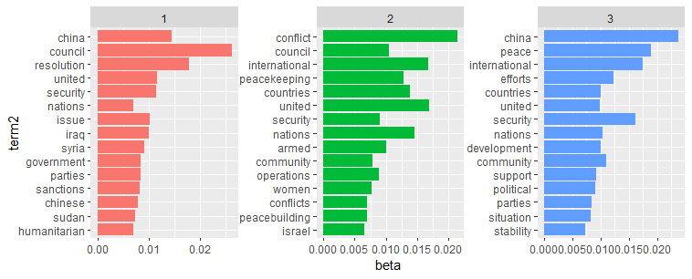
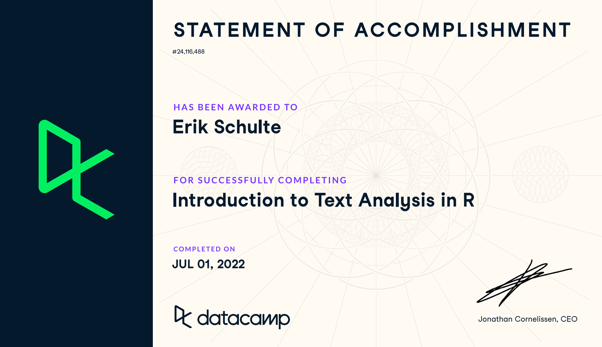

```{r setup, include=FALSE}
knitr::opts_chunk$set(echo = TRUE)
```

# Introduction \label{Introduction}

Recently, the geopolitical architecture of the world is becoming more and more challenged. Established institutions such as the United Nations (UN) and its lower-tier institutions are shaken by international disputes. One of the most apparent shifts is the ever-growing importance of China in the international arena. This shift in power weights is also reflected in China's international demeanour, diplomacy and communication. The term "wolf warrior diplomacy" [@wolfs] became a widespread synonym for this China's growing confidence and aggressive representation of its policy objectives. Its claims in the congested and strategically important South China Sea is one of the areas, where the country's interests are represented vividly. \newline
Therefore, it would be interesting if this development and shifts in policy objectives can also be observed in China's official communication in the current international institutions. China is a permanent member of the United Nations Security Council (UNSC) and the importance of this body, makes it an interesting case to study. The data by @UNSC is an ideal match for my study purposes. My first hypothesis is that China's use of language became more demanding and direct given in light of the wolf warrior diplomacy. \newline
Based on the theory of China's potential shift in policy objectives in the UNSC, I now conduct the empirical evaluation. For this purpose, I first describe the data preparation process. Secondly, I conduct the actual computer-assisted text analysis which presents several measures and examines the hypothesis.^[My analysis generally following the great resources of @tidytext and @datacamp.]

# Link between Machine Learning and Text Analysis

The data of the speeches of @UNSC data are unstructured. Quantitative text analysis -- that is employed in this paper -- is a machine learning (ML) technique that seeks to automatically gain valuable insights from large amounts of unstructured text data. The major challenge of quantitative text analysis is to take the ambiguities of human language into account -- an issue that can only be partially addressed in this paper. An example, is the negation word "not", which may totally change the context in which certain words are used. \newline
My paper will solely focus on unsupervised machine learning methods that are applied by [@tidytext \& @datacamp]. In general, quantitative text analysis is covered in parts of ML and Natural Language Processing (NLP). I will cover text mining techniques such as word frequency, text classification such as sentiment analysis and topic modelling. Important challenges to apply ML to text are the complexity of the analysis, the conceptual difficulties (e.g. humour/sarcasm in human language) and taking into account cultural norms of communication [@textML]. For further reading on the link between text mining and ML, I refer to @ML2019.

# Data  {-}
First of all, I present all relevant data sources and explain essential features to get a proper overview. Afterwards, I explain the process of loading the data into R and how we process the raw text corpus, to obtain meaningful results.\newline
For the empirical analysis, we use three main data sources. The main data set comprises UN Security Council debates between January 1995 and December 2020 and was downloaded from @UNSC. These comprise official meeting protocols are further subdivided into distinct speeches. Every speech includes metadata regarding the speaker, who he or she represents, and the speaker's role (e.g. guest) in the meeting. Details about the topic and subtopics as well as agenda details of the meeting are also part of the data set. In total, the corpus contains 82,165 speeches extracted from 5,748 meeting protocols. The download file of @UNSC also provide a codebook with the exact description of their workflow and how to set-up the database as well as a detailed variable description.
\newline
The data are split into a file containing all information about the UNSC meetings, one file about the metadata of the speeches and one file containing the whole text of the speeches. The other two data sources used are word dictionaries for the sentiment analysis. I decided to apply a dictionary-based sentiment analysis which allows me to evaluate the sentiment of the speech data based on signalling words. The alternative would be a data-driven corpus approach, which is however more sophisticated and not further pursued here. It is crucial for the sentiment analysis, that the dictionaries are suitable for the specific context of analysis. For example, a word list developed for sociology may not be a good fit to analyze text data from finance, and vice versa. The selection of the right word lists is therefore of uttermost importance to get meaningful and robust results @grimmer2013[pp. 274-275]. \newline
Hence, I carefully choose only certain categories from the dictionaries which are less prone to missclassification. Two wordlists namely Military and Cooperation are from the most widely used standard dictionary, the Harvard General Inquirer (see @GeneralInquirer). The other four wordlists: Positive, Uncertainty, Strong Modal and Weak Modal are from @Loughran. Word categories that were specially adapted to the financial context by @Loughran, such as the negative wordlist, are neglected in my analysis.

## Data preparation
In the next step, I import the speech data into R from the data folder of my project file. To be able to process larger amounts of text, I need special packages in R. These include the quanteda, quanteda.textplot and quanteda.textstats. Other libraries like tidyverse, magrtittr, dyplr, ggplot2, readtext, and kableExtra are used to manipulate the data and plot it. We also set a seed, so that our results are reproducible.
```{r, echo=TRUE, warning=FALSE, message=FALSE}
knitr::opts_chunk$set(fig.width = 6, fig.height = 5, fig.pos="H", fig.pos = 'H')
#load required packages
library(tidyverse)
library(readtext)
library(quanteda)
library(quanteda.textplots)
library(quanteda.textstats)
library(ggplot2)
library(magrittr)
library(gdata)
library(kableExtra)
library(tidytext)
library(dplyr)

#load the UN Security Council Debates dataset
load("data/dataset.RData")
load("data/docs.RData")

#set a seed for reproducability
set.seed(2333)
```

I then rename the filename column of the data frame containing the metadata of the speeches into doc_id in order to have a common identifier for merging with the actual text data from the speeches (raw_docs).
```{r}
##rename common column to merge the content of the speeches
meta_speeches <- meta_speeches %>%
  rename(doc_id = filename) |> 
   filter(participanttype != "The President")

## merge dataset raw with speeches
meta_speeches <- merge(meta_speeches, raw_docs, by = 'doc_id')
```

In the next step I want to make a corpus from my data. A corpus is the a certain data structure before the tokenization of the text data. It includes document-level variables that are unique to each data point of text, as well as meta-data for documents (speeches in this case) and for the collection as a whole. \newline
The command corpus comes from the quanteda package. Hence, the text column of the meta_speeches data frame are now a corpus. I filter out speeches from the president of the UNSC, as he or she mostly speaks on behalf of the organization and not for their respective country. This reduces the number of speeches by about 30,000 to 50,933 speeches.

```{r}
#as_corpus_frame(meta_speeches$text, filter = NULL, row.names = NULL)
corp_meta_speeches <- corpus(meta_speeches, text_field = "text")
summary(corp_meta_speeches, 1)
corp_meta_speeches <- corpus_subset(corp_meta_speeches, participanttype != "The President")
```

The summary shows one example of how one observation of the corpus looks like. It has 22 variables and exhibits information on the topics of the speech, speech length, speaker and the link to the speech itself among other variables. I suggest the code book of @UNSC for the exact variable descriptions. \newline
I also create a unique corpus just for the speeches held by China. I do this using the corpus_subset command from my previously defined corpus. I also take a subset of the meta_speeches data frame with only the speeches from China. In total there are 3564 speeches by China in the data frame, a total share of 3.82% of all speeches. So there appear to be 1619 speeches from China as participant type president. So, the speeches where China speaks on behalf of the president are excluded.

```{r}
#How do I assign the speeches to the columns (now the speeches are in the same order as in the document, but not tied to the countries)

corp_China <- corpus_subset(corp_meta_speeches, country == "China")
Chinaspeeches <- subset.data.frame(meta_speeches, country == "China")
share_CHN_speeches <- 1945/50933
#*
#only creates value, which I mention in the text.

## access to document level variables of the China corpus
head(docvars(corp_China))

##extract them the document level variables
#docvars(corp_China, field = "speaker")

#corp_China$year

##create new variables (does not work yet)
#corp_China$avg_speech_length <- (mean(corp_China$sentences))
#avg_speech_length
```

We an see the meta data of the China corpus inclusing the names of the speakers, the reference to the speech data file, the topic etc., as described above.
As a next step, I separate the whole speeches into sentences in tidy format. One column for every sentence of a speech. For that I use the unnest_tokens function from the tidytext package. This lets the the number of observations grow to 1,767,696 million. The problem here is that now after every salutation like "Mr.", so after every point the function creates a new sentence. When we create a data frame for every word as an observation, the number of observation grows to 43,534,652 million. Therefore, we must clean the data further before using them for analysis.

```{r}
##separates by default into words all speeches from raw docs (here by sentences) variable after tokens
tidy_raw_sentences <- meta_speeches %>%
  unnest_tokens(sentences_content, text, token = "sentences" )

##separate into words a new variable each word per speech (gives us 47,4 Mio obs.)
tidy_raw_words <- meta_speeches |> 
    unnest_tokens(word, text)
```

The tidytext package also come with a list of stop words -- words that are not meaningful and that we want to exclude from the analysis. The stop words list contains 1149 words. Our data frame reduces to 19,623,316 million observations -- by more than a half. 

```{r, echo=FALSE, message=FALSE}
##remove redundant words (reduces from 47,6 Mio words to 21,4 Mio words)
data(stop_words)  ##this comes with a package (a list of unuseful words)

tidy_raw_words <- tidy_raw_words %>%
  anti_join(stop_words)

##count words, after redundant words were removed (only meaningful words)
# tidy_raw_words %>%
#   count(word, sort = TRUE)
```

This allows me to start with a first analysis. I can plot the most frequent words used in the speeches of the UNSC. For that, I plot the most common words that were used more than 65,000 times in total. The threshold of 65,000 is subjectively chosen and is based on the graphical aesthetics.

# Most commonly used words
We can see from the graph that council, security and united are the most frequently used words. This gives are first overview of the most used words.

```{r, message=FALSE, warning =  FALSE, fig.align = 'center', fig.cap = "Most common words in UNSC.\\label{Figure1}", fig.ext = 'png', fig.height = 5, fig.width = 7}
##plotting most common words (mit mehr als 80.000 Wörtern)
library(scales)
most_common_words_UNSC <- tidy_raw_words %>%
  count(word, sort = TRUE) %>%
  filter(n > 65000) %>%
  mutate(word = reorder(word, n)) %>%
  ggplot(aes(n, word)) +
scale_x_continuous(labels = comma_format(big.mark = ".",
                                           decimal.mark = ",")) +
  geom_col() +
  #  ggtitle = (label = "The most common words in the UNSC")+
  labs(y = NULL, title = "Most common words in the UNSC")
 
 most_common_words_UNSC
```

I also plot the exact same information of the 40 most common words from the UNSC in a visually appealing wordcloud using the wordcloud package.

```{r, echo=FALSE, message=FALSE, warning =  FALSE, fig.align = 'center', fig.cap = "Wordcloud of most common words in UNSC.\\label{Figure2}", fig.ext = 'png', fig.height = 5, fig.width = 7}
# Load the wordcloud package
library(wordcloud)

# Compute word counts and assign to word_counts
word_counts_UNSC <- tidy_raw_words %>% 
  count(word)

wordcloud(
  # Assign the word column to words
  word = word_counts_UNSC$word, 
  # Assign the count column to freq
  freq =word_counts_UNSC$n,
  scale=c(2,.4),
  max.words = 40,
  colors = "blue"
)
```

I then apply the exact same analysis for the data frame from the Chinese speeches.

```{r, include=FALSE}
#same analysis for Chinese speeches....
##separates by default into words all speeches from raw docs (here by sentences)
tidy_raw_sentences_CHN <- Chinaspeeches %>%
  unnest_tokens(sentences_content, text, token = "sentences" )  

#How do I assign the speeches to the columns (now the speeches are in the same order as in the document, but not tied to the countries)

#separate into words
tidy_raw_words_CHN <- Chinaspeeches |>
    unnest_tokens(word, text)

##remove redundant words (reduces to 600k thousand words)
#data(stop_words)  ##this comes with a package (a list of unuseful words)

tidy_raw_words_CHN <- tidy_raw_words_CHN %>%
  anti_join(stop_words)

##count words, after redundant words were removed (only meaningful words)
tidy_raw_words_CHN %>%
  count(word, sort = TRUE)
```

We can see that China's five most commonly used words are the same as for the UNSC, except that its country name is the most used words. This is not surprising as country's commonly hold speeches referring to them with their country name. Note that most Chinese speeches were held in Chinese and that the speech data here were translated into English. These respective speeches have a note in brackets "(interpretation from chinese") that I did not remove from the text data.

```{r, echo=FALSE, message=FALSE, warning =  FALSE, fig.align = 'center', fig.cap = "Most common words used by China.\\label{Figure3}", fig.ext = 'png', fig.height = 5, fig.width = 7}
##plotting most common words
most_common_CHN <- tidy_raw_words_CHN %>%
  count(word, sort = TRUE) %>%
  filter(n > 2500) %>%
  mutate(word = reorder(word, n)) %>%
  ggplot(aes(n, word)) +
    scale_x_continuous(labels = comma_format(big.mark = ".",
                                           decimal.mark = ",")) +
  geom_col() +
  labs(y = NULL, title = "Most common words used by China")
most_common_CHN
```

Again, I visualize the 40 most common words used by China in a wordcloud using the wordcloud package.

```{r, message=FALSE, warning =  FALSE, fig.align = 'center', fig.cap = "Wordcloud most common words used by China.\\label{Figure4}", fig.ext = 'png', fig.height = 5, fig.width = 7}
# Load the wordcloud package
library(wordcloud)

# Compute word counts and assign to word_counts
word_counts_CHN <- tidy_raw_words_CHN %>% 
  count(word)

wordcloud(
  # Assign the word column to words
  word = word_counts_CHN$word, 
  # Assign the count column to freq
  freq =word_counts_CHN$n,
  scale=c(2,.4),
  max.words = 40,
  colors = "red"
)
```

Next, we want to get further than just plotting the most frequently used words. One of the big issuesin text mining and natural language processing is the question how to quantify what a document is about. One approach provides a measure of how important a word may be. This approach is called term frequency (tf) -- how frequently a word occurs in a document. \newpage

# Frequency terms
Next, I calculate frequency terms. The function get_freqs creates a list of the frequency of terms that appear in each speech. The function takes the respective corpus as an input and returns the frequencies in the form of a data frame. In the first step, it creates tokens from the text documents. Tokens are a sequence of elementary lexical components, in our case words. Punctuation, separators and stop words like “he”, “do”, or “if” are excluded as they have no meaning for the content and therefore represent no real added value for the analysis. \newline
This gives a number to how important a word is to a document compared with a corpus of other documents, e.g. one speech in a collection of speeches. The inverse document frequency of a term is defined as:

$idf(\text{term}) = \ln{\left(\frac{n_{\text{documents}}}{n_{\text{documents containing term}}}\right)}$

In the end we apply the get_dfm function to the two corpora and save the result in the variable freqs_all and freqs_CHN respectively.

```{r, include=FALSE}
#calculate the frequency of terms that appear in each speech. It also creates a document feature matrix.
#frequency of each word in the corpus
#function takes the respective corpus as an input and returns the frequencies in the form of a data frame
get_freqs <- function(corp_meta_speeches, weighting = TRUE){
tokens <- tokens(corp_meta_speeches, remove_punct = T, remove_separators = T, include_docvars = T)
tokens <- tokens_remove(tokens, stopwords("en"))
dfm <- tokens %>% dfm()
freqs <- textstat_frequency(dfm)

if(weighting == TRUE){
freqs$term_frequency <- freqs$frequency / sum(freqs$frequency)
freqs$inverse_doc_freq <- log10( length(corp_meta_speeches) / freqs$docfreq )
freqs$frequency <- freqs$term_frequency*freqs$inverse_doc_freq
}
return(freqs)

}

freqs_CHN <- get_freqs(corp_China,weighting=TRUE)
freqs_all <- get_freqs(corp_meta_speeches,weighting = TRUE)

#Mr. und Mrs. is still inside, maybe you can research something on the gender of the diplomats

#The dfm() function is then applied to the tokens to create the document feature matrix (dfm). As the dfm is a very sparse matrix containing the documents as rows and the terms as columns, I aggregate the data over all documents and sort the frequency of the terms in a descending order using the textstat_frequency() command. In addition, a special feature of the get_freqs function is the weighting parameter, which is set to FALSE per default. If it is being activated the frequencies are weighted according to the term-frequency inverse document frequency (tf.idf) weighting scheme.
```
We then get a new data frame with each word, the frequency (percentage share of appearance of all words), the rank based on the frequency, the total document frequency of the words, the term_frequency and the inverse_term_frequency. We will come back and make use of this at a later stage.

I also create a data frame which counts usage of every word in all speeches. This shows that we have 13494 unique words in the data frame used by China after deleting the stop words. I do the same but count the frequency for every word used by China by speech. I will use these newly created data frames for my subsequent \ref{Figure5}.
It should be noted here that I only further proceed with the corpus for the Chinese speeches giving the scope limitations of this project. Nevertheless, it would be interesting to pursue an in depth comparison of the general UNSC language compared to China's use of language. I solely put my attention to the Chinese speeches in the following while keeping the confidence to draw meaningful conclusions from the analysis.
```{r}
speech_words_CHN <- tidy_raw_words_CHN %>%
 # unnest_tokens(word, text) %>%
  count(word, sort = TRUE) |> 
    mutate(total = sum(n))

speech_words_CHN_per_speech <- tidy_raw_words_CHN %>%
 # unnest_tokens(word, text) %>%
  count(speech, word, sort = TRUE) |>   ##now sorted by speech
    mutate(total = sum(n))
```

## Visualizing term frequency in China's speeches
The graph shows the number of times a word appears in the speeches divided by the total number of terms (words) in the speeches. There are very long tails to the right for the Chinese speeches (those are extremely rare words) that I do not include in the plot. Hence, a plethora of words occurs rarely and few words occur very often.

```{r, message=FALSE, warning =  FALSE, fig.align = 'center', fig.cap = "Term frequency distribution in China's speeches.\\label{Figure5}", fig.ext = 'png', fig.height = 5, fig.width = 7}
ggplot(speech_words_CHN, aes(n/total)) +
  geom_histogram(show.legend = FALSE) +
  xlim(NA, 0.0009) +
    labs(
        title = "Term frequency distribution in China's speeches",
        subtitle = "Distribution of frequency of words divided by total words"
    )
#  facet_wrap(~book, ncol = 2, scales = "free_y")
```

The distribution we can see here is common in language. These long-tailed distributions are very common in natural language (like books, a lot of text from a website, or spoken words). Hence, the relationship between the frequency of words used and their rank has attracted academic interest. \newline 
A famous mathematical approach to this area is called Zipf’s law. The name attributes George Zipf, a 20th century American linguist. Zipf law stipulates that the prevalence of a word is inversely proportional to its rank [@tidytext]. Words occur in a systematic frequency distribution with very few words used very frequently and a plethora of words used less frequent. This distribution follows a power law -- Zipf's law [@zipf]. I proceed by calculating the rank of each word and its frequency.

```{r}
freq_by_rank_CHN <- speech_words_CHN %>% 
  mutate(rank = row_number(), 
         `term frequency` = n/total) %>%
  ungroup()

head(freq_by_rank_CHN)
```

The rank column gives the rank of each word within the frequency table. As the table is already ordered by its frequency (n), I apply row_number() to find the rank. Subsequently, I calculate the term frequency. It is possible to visualize Zipf's law. For that, the rank is displayed on the x-axis and the term frequency on the y-axis, both on logarithmic scales. This plot equals an inversely proportional relationship, which has a constant, negative slope.

## Zipf's law visualization

```{r, echo=FALSE, message=FALSE, warning =  FALSE, fig.align = 'center', fig.cap = "Simple Zipf's law in China's speeches.\\label{Figure6}", fig.ext = 'png', fig.height = 5, fig.width = 7}
freq_by_rank_CHN %>% 
  ggplot(aes(rank, `term frequency`)) + 
  geom_line(size = 1.1, alpha = 0.8, show.legend = FALSE) + 
  scale_x_log10() +
  scale_y_log10() +
    labs(
        title = "Zipf's Law for China's speeches in the UNSC"
    )
```

We keep in mind here that the Zipf's law figure is in log-log coordinates. We can learn that the relationship between rank and frequency does have the expected negative slope -- Zipf's law holds. However, the line is not constant especially at its tails.  This could suggest that perhaps this as case where the power law is broken [@tidytext].
Next, I investigate the exponent of the power law for the middle section (between ranks 10 and 500) of the rank range [see @tidytext]. I further regress the log of the term frequency on the rank for the data between the ranks of 10 to 500 and fit a line with the respective intercept and coefficient in \ref{Figure6}.

```{r}
rank_subset <- freq_by_rank_CHN %>% 
  filter(rank < 500,
         rank > 10)

lm(log10(`term frequency`) ~ log10(rank), data = rank_subset)
```

The classic versions of Zipf's law can be expressed as follows:
$\text{frequency} \propto \frac{1}{\text{rank}}$

The r-th most frequent word has a frequency that scales according to the above formula. The frequency rank is the r-th most frequent words and frequency is the frequency of a word in a natural corpus (speech in our case). 

```{r, message=FALSE, warning =  FALSE, fig.align = 'center', fig.cap = "Fitted exponent for Zipf's law for Chinese speeches.\\label{Figure7}", fig.ext = 'png', fig.height = 5, fig.width = 7}
freq_by_rank_CHN %>% 
  ggplot(aes(rank, `term frequency`)) + 
  geom_abline(intercept = -1.19, slope = -0.81, #take these numbers from the regression above
              color = "red", linetype = 4) +
  geom_line(size = 1.1, alpha = 0.8, show.legend = FALSE) + 
  scale_x_log10() +
  scale_y_log10() +
    labs(
        title = "Fitting an exponent for Zipf's Law with China's speeches in the UNSC")
```

The result akins the classic version of Zipf’s law for the corpus of China's UNSC speeches. The deviations at the high rank are not uncommon in human language. Usually, a language corpus does contain fewer rare words than any single power law would predict. Nevertheless, the deviations at low rank are more unusual compared to the deviations from the fitted line at high rank. China uses a lower percentage of uncommon words than many collections of language, which may indicate the complexity of the diplomatic language [see @diplo].

## The bind_tf_idf() function
The intuition of tf-idf is to identify crucial words for the speech by decreasing the weight for the most commonly used words and doing the reverse for less frequent words in the collection of speeches -- the speeches by China in the UNSC. tf-idf attempts wants to find the important words that are common in a text, but not too common [@tidytext].
 
The bind_tf_idf() function in the tidytext package takes a tidy text data set as input. One column (word here) contains the terms/tokens, one the documents (speech in this case), and the last necessary column contais the information how many times each speech contains each term (n in this example). I create a new data frame for this, as the bind_tf_idf function requires a document entry (speeches in my case). 
 
```{r, echo=FALSE}
CHN_tf_idf <- speech_words_CHN_per_speech %>%  #86955 variables...
  bind_tf_idf(word, speech, n)

head(CHN_tf_idf)
```

The idf and thus tf-idf are zero for these most common words (China). Unsurprisingly, the word China appears very often in the speeches of China, so the idf-term is zero because the natural log will be close to 1. The inverse document frequency and thus tf-idf is close to zero for words that occur in many of the compilated speeches. This is, in fact, the procedure how this approach reduces the weight for common words. The inverse document frequency will be a higher number for words that occur in fewer speeches [@tidytext].
 
```{r, message=FALSE}
important_words_speech <- CHN_tf_idf %>%
  select(-total) %>%
  arrange(desc(tf_idf))
head(important_words_speech)
```

Here we see important words that are in fact important in these respective speeches. None of them occurs in all of speeches. But they are important, characteristic words for each speech within the corpus of the UNSC speeches by China. We can see that one speech (speech 129) most likely talked about the still ongoing territorial disputes in the South China Sea, as nansha, islands, and sea were important words in that speech.

```{r, echo=FALSE}
#make this example reproducible
set.seed(1)

#define data
high_tf_idf_CHN <- data.frame(speech=c('110', "129", '129', '51', "129", "51"),
                 word=c('japanese', 'nansha', "islands", "1422", "sea", "icc"),
                 n=c(13, 3, 4, 1, 7, 3),
                tf=c(0.036011080, 0.015384615, 0.020512821, 0.014492754, 0.035897436, 0.043478261),
                idf=c(2.1972246, 3.8066625, 2.7080502, 3.8066625, 1.4087672, 1.0986123),
                tf_idf=c(0.07912443, 0.05856404, 0.05554975, 0.05516902, 0.05057113, 0.04776575))
                
#view head of data 
head(high_tf_idf_CHN)
```

```{r, include=FALSE}
library(forcats)

CHN_tf_idf %>%
  group_by(speech) %>%
  slice_max(tf_idf, n = 15) %>%
  ungroup() %>%
  ggplot(aes(tf_idf, fct_reorder(word, tf_idf), fill = speech)) +
  geom_col(show.legend = FALSE) +
  facet_wrap(~speech, ncol = 1, scales = "free") +
  labs(x = "tf-idf", y = NULL)
```
\newpage
# Sentiment Analysis

For the sentiment analysis, I have to get dictionaries for my purpose into R. I choose to do a dictionary-based approach as I am a beginner in text analysis.  In accordance with processing of the speech data, we lower all dictionary terms so that the matching function is case sensitive.  Two wordlists, namely Military and Cooperation are from the most widely used standard dictionary, the Harvard General Inquirer @GeneralInquirer. I manually collected this word list and saved them in an excel file. It was difficult to obtain due to restricted access. I create the new data frame called "dict" with these two categories after making all words to lower case letters.

```{r}
library(readxl)
GI_dic <- read_excel("~/ownCloud/Uni Göttingen/Stellenbosch University/Data Science Methods/Github Projects/Machine Learning Project/data/General_Inquire.xlsx")

GI_dic$military <- tolower(GI_dic$military) #make words to lower case in military columns
GI_dic$powercoop <- tolower(GI_dic$powercoop) #mark words to lower case in powercoop column
colnames(GI_dic) <- tolower(colnames(GI_dic))

dict <- GI_dic |> 
    select(military, powercoop)  
```

The second dictionary I am using is the one by @Loughran. From this I append the word lists "Positive, "Uncertainty", "Strongmodal" and "Weakmodal" to my dictionary.

```{r}
loughran <- read_excel("~/ownCloud/Uni Göttingen/Stellenbosch University/Data Science Methods/Github Projects/Machine Learning Project/data/LoughranMcDonald_SentimentWordLists_2018.xlsx")

colnames(loughran) <- tolower(colnames(loughran))
# Select the following 4 categories for my analysis, exclude negative inter alia
loughran <- loughran[c("positive","uncertainty","strongmodal","weakmodal")]
# make all words to lower case
loughran$positive <- tolower(loughran$positive)
loughran$uncertainty <- tolower(loughran$uncertainty)
loughran$strongmodal <- tolower(loughran$strongmodal)
loughran$weakmodal <- tolower(loughran$weakmodal)

#cbindX = column-binds objects with different number of rows. 
dict <- cbindX(dict, loughran)
colnames(dict) <- c("Military","Cooperation","Positive","Uncertainty","Strongmodal",
"Weakmodal")
```

```{r, include=FALSE}
sentiment_analysis <- function (freqs_all, freqs_CHN, dict){
data <- data.frame(matrix(NA,2,dim(dict)[2]))  #data is the storage table
colnames(data) <- colnames(dict)

for (i in colnames(data)){
join_1 <- freqs_all %>% inner_join(dict, by= c("feature" = i))
a <- sum(join_1$frequency)/sum(freqs_all$frequency)*100

join_2 <- freqs_CHN %>% inner_join(dict, by= c("feature" = i))
b <- sum(join_1$frequency)/sum(freqs_CHN$frequency)*100

data[i] <- rbind(a,b)
}
return(data)

}

#The second important function called sentiment_analysis uses this dict data frame together with the previously created term frequency tables as inputs. It then calculates a proportional count of each category to measure the tone of the language and outputs the result as a data frame. To do so, the function initializes a storage table for our results named data. The column names of the result table are set to the categories contained in the dictionary table. We then iterate through the column names (i.e. the categories) to match the words of each category with the term frequency tables. The resulting data frame join_1 contains only the words, that are in both data frames (this is called an inner join). We then calculate the share of words for each category from the overall frequency. The same is applied to the second term frequency table and then saved to the result table.
```


<table>
<caption><span id="tab:table2">Table: </span>Selected words from the dictionary.</caption>

Military       Cooperation     Positive      Uncertainty      Strong modal     Weak modal
------------  -------------  -------------  --------------   ---------------  -----------
Weapon        Peace          Strengthen     Variation        Always           Apparently
Fleet         Joint          Stabilize      Unknown          Best             Depending
Ammunition    Partnership    Progress       Perhaps          Strongly         Might
War           Mediation      Improve        Appear           Unparalleled     Possible
Troop         Consensus      Prosperity     Conditional      Undisputed       Sometimes

</table>

My self-created tidy dictionary contains two columns with 863 words and six sentiment categories in total. 88 words belong to the Cooperation word list, 79 to the Military word list, 353 to the Positive word list, 19 to the strong modal word list, 297 to the uncertainty word list and 27 to the weak modal word list. The table above gives examples of the words the sentiment categories comprise of.

```{r, echo=TRUE, results='hide'}
##also create a tidy dictionary, we I have 863 words with 5 sentiment categories in total
tidy_dict <- dict %>% tidyr::gather("Sentiment", value, 1:6) |> 
    rename(word = value) |> 
    drop_na() 
#make a tibble out of it
as_tibble(tidy_dict) 
```

```{r, include=FALSE}
#
words_per_sentiment <- tidy_dict |>  
   count(Sentiment)
```

Next, present my dictionary also graphically in \ref{Figure8}. By far most of my sentiment indicating words are in the "positive" and "uncertainty" category. 

```{r, echo=FALSE, message=FALSE, warning =  FALSE, fig.align = 'center', fig.cap = "Sentiment Counts per sentiment in my dictionary.\\label{Figure8}", fig.ext = 'png', fig.height = 5, fig.width = 7}

sentiment_counts <- tidy_dict %>%  
  count(Sentiment) %>%  
 mutate(sentiment2 = fct_reorder(Sentiment, n)) 
ggplot(sentiment_counts, aes(x = sentiment2, y = n)) + 
  geom_col() + 
  coord_flip() + 
  labs( 
    title = "Sentiment Counts in my personalised dictionary", 
    subtitle = "Number of Counts for the six Sentiment Wordlists",
    x = "Sentiment", 
    y = "Counts" 
  )
```

## Join the dictionary with the speech data
For the sentiment, analysis I want to evaluate the sentiment of the words of the speech corpus. Hence, I create a new data frame using the inner_join function that appends the my sentiment dictionary in tidy format to the data frame from China containing all words. I can then see that out of the 522,480 words used by China, 44,588 match to my dictionary (8.53%). I then mutate a new column which calculates the share of the sentiment used. For China, we can see that 38.07% of the sentiments fall into the cooperation word list, 10% in the military word list, 47.86% in the Positive sentiment word list, 3.28% in the uncertainty word list and very small shares in the strongmodal and weakmodal categories. 
What is apparent at first is that, although the uncertainty word list has a multiple times higher share on the words in my dictionary, it is the reverse in the share of sentiments in China's speeches.

```{r, message=FALSE}
sentiment_review_CHN <- tidy_raw_words_CHN |> 
    inner_join(tidy_dict)
sentiment_review_CHN |> 
    count(Sentiment) |> 
    mutate(share_sentiment_category = n/44588)
```

We can further see the most words that appear both in my dictionary and in China's speeches. The high share of the cooperation sentiment is driven by the very frequent use of the word "peace" (7095 times). This is followed by the words cooperation, stability, strengthen, achieve and progress in descending order.

```{r, echo=FALSE}
sentiment_review_CHN |> 
    count(word, Sentiment) |> 
    arrange(desc(n)) |> 
    head()
```

## Visualizing sentiments
First, I count the most common words in the speech that match the six respective sentiment word list. I group them by sentiment and filter the ten most common words for each category and order them in descending order.
```{r}
word_counts_CHN2 <- sentiment_review_CHN %>%  
  count(word, Sentiment) %>%  
  group_by(Sentiment) %>% 
  top_n(10, n) %>%  
  ungroup() %>%  
  mutate( 
    word2 = fct_reorder(word, n) 
  )
```

In this graph, I visualized the sentiments of each of the six categories, so that we can see the most common words for each category. In the Cooperation sentiment word list, the word peace appears by far the most with more than 6000 appearances. from the military word list, "armed", "force" and "draft" are most used. An interesting results is that while my dictionary consists by far more words from the uncertainty list than the military list, the sentiment words counts from China's speeches from the military list by far exceed the ones from the uncertainty list. This could indicate that China uses a more aggressive military jargon. But it could also be the case that the military dictionary is simply fitting the context of the UNSC speeches better than the uncertainty word list.

```{r, echo=FALSE, message=FALSE, warning =  FALSE, fig.align = 'center', fig.cap = "Sentiment word counts for Chinese speeches.\\label{Figure9}", fig.ext = 'png', fig.height = 5, fig.width = 7}
ggplot(word_counts_CHN2, aes(x = word2, y = n, fill = Sentiment)) + 
  geom_col(show.legend = FALSE) + 
  facet_wrap(~ Sentiment, scales = "free") + 
  coord_flip() + 
  labs( 
    title = "Sentiment Word Counts China", 
    x = "Words" 
  )
```

## Chinese sentiments over time
The following gives a table of the counts of the sentiments by Year.

```{r}
sentiment_over_time_CHN <- sentiment_review_CHN |> 
    count(year, Sentiment) |>  #see how genius the spread command is
    spread(Sentiment, n) 
```

We can also plot this nicely in a graph, which shows the number of the sentiment words used over time for each of the six sentiment categories. For this I plot a graph over time for each of the six sentiment categories, whose code I do not show here.

```{r, include=FALSE}
Military_CHN <- ggplot( 
  sentiment_over_time_CHN,  
  aes(x = year, y = Military, group = 1)
) + 
  geom_line(show.legend = FALSE, color = "red") + 
 # coord_flip() + 
  labs( 
    title = "Overall Sentiment by Year", 
    subtitle = "Sentiment over time: Military", 
    x = "Years", 
    y = "n" 
  ) 

Cooperation_CHN <- ggplot( 
  sentiment_over_time_CHN,  
  aes(x = year, y = Cooperation, group = 1)
) + 
  geom_line(show.legend = FALSE, color = "red") + 
 # coord_flip() + 
  labs( 
    title = "Overall Sentiment by Year", 
    subtitle = "Sentiment over time: Cooperation", 
    x = "Years", 
    y = "n" 
  ) 

Positive_CHN <- ggplot( 
  sentiment_over_time_CHN,  
  aes(x = year, y = Positive, group = 1)
) + 
  geom_line(show.legend = FALSE, color = "red") + 
 # coord_flip() + 
  labs( 
    title = "Overall Sentiment by Year", 
    subtitle = "Sentiment over time: Positive", 
    x = "Years", 
    y = "n" 
  ) 

Strongmodal_CHN <- ggplot( 
  sentiment_over_time_CHN,  
  aes(x = year, y = Strongmodal, group = 1)
) + 
  geom_line(show.legend = FALSE, color = "red") + 
 # coord_flip() + 
  labs( 
    title = "Overall Sentiment by Year", 
    subtitle = "Sentiment over time: Strongmodal", 
    x = "Years", 
    y = "n" 
  ) 

Uncertainty_CHN <- ggplot( 
  sentiment_over_time_CHN,  
  aes(x = year, y = Uncertainty, group = 1)
) + 
  geom_line(show.legend = FALSE, color = "red") + 
 # coord_flip() + 
  labs( 
    title = "Overall Sentiment by Year", 
    subtitle = "Sentiment over time: Uncertainty", 
    x = "Years", 
    y = "n" 
  ) 

Weakmodal_CHN <- ggplot( 
  sentiment_over_time_CHN,  
  aes(x = year, y = Weakmodal, group = 1)
) + 
  geom_line(show.legend = FALSE, color = "red") + 
 # coord_flip() + 
  labs( 
    title = "Overall Sentiment by Year", 
    subtitle = "Sentiment over time: Weakmodal", 
    x = "Years", 
    y = "n" 
  ) 

```

I then use the gridExtra package to display the individually created graphs in one graph.

```{r, message=FALSE, warning =  FALSE, fig.align = 'center', fig.cap = "Sentiment over time used by China.\\label{Figure10}", fig.ext = 'png', fig.height = 5, fig.width = 7}
#one line of code to put the pictures in one graph
library(gridExtra)
CHN_sentiment_development <- grid.arrange(Cooperation_CHN, Military_CHN, Positive_CHN, Strongmodal_CHN, Uncertainty_CHN, Weakmodal_CHN, nrow=3, ncol=2)
```

The graph yields interesting result. First, there appear to be a general trend that the Sentiments increases over time in all six categories, indicating more matches of China's words used and the dictionary. However, this could be due to a simple increase in speeches held by China, especially since the inauguration of Xi Jinping as president in 2012. 
The cooperation, military, positive and uncertainty sentiment categories all exhibit similar patterns of time. The strong- and weak modal list is more volatile, which is however also driven my the small number of total sentiments in these lists because they comprise of few words.

# Relationships between words
The tidytext package also offers methods for calculating and visualizing relationships between words in the speeches. Setting the token = "ngrams" in the previously used unnest_tokens function tokenizes by neighbouring words rather than by single words as I did for the tidy_raw_words_CHN data frame.
Using this function to tokenize into consecutive sequences of words is called n-grams. By analysing how often a specific words is followed by another one can yield valuable information. Note here that Chinaspeeches is not cleaned from the stopwords list, this is also applied in @tidytext. This will be done later.
 
```{r}
bigram_CHN <- Chinaspeeches |> 
    mutate( speech = Chinaspeeches$speech) |> 
  unnest_tokens(bigram, text, token = "ngrams", n = 2)

#head(bigram_CHN)
```

The data structure is now not a pure tidy format anymore, but it still has one row per token, in a sense that each token comprises two words. We can still use the tools for tidy data. Similary to single, tokens before we can count the most common bigrams. The data frame is rather long now, because the bigrams overlap: "Xuexan china" and "china interpretation" are respective bigrams. 

```{r}
bigram_CHN <- bigram_CHN |> 
  count(bigram, sort = TRUE)
head(bigram_CHN)
```

We can see that by far the most common bigram is "of the", occurring 17766 times followed by other meaningless common words. These are stop-words that we want to remove. I use tidyr’s separate(), which splits a column into multiple. This divides the bigrams into two columns named “word1” and “word2”. Bigrams_filtered_CHN is the data frame where either of the bigrams is not a stop-word.

```{r, message=FALSE}
bigrams_separated_CHN <- bigram_CHN %>%
  separate(bigram, c("word1", "word2"), sep = " ")

bigrams_filtered_CHN <- bigrams_separated_CHN %>%
  filter(!word1 %in% stop_words$word) %>%
  filter(!word2 %in% stop_words$word)

# new bigram counts:
bigram_counts_CHN <- bigrams_filtered_CHN %>% 
  count(word1, word2, sort = TRUE) 
```

Next, I want to recombine the words of the bigrams. tidyr’s unite() function is the inverse of separate(), and lets us merge the words into one column again. Thus, we may find the most common bigrams not containing stop-words.

```{r, echo=FALSE}
bigrams_united_CHN <- bigrams_filtered_CHN %>%
  unite(bigram, word1, word2, sep = " ")

head(bigrams_united_CHN$bigram)
```

From the output we can see that (unsurprisingly) the most common bigram is "united nations", appearing 5478 times. More meaningful is the bigram "middle east", which suggests that conflicts in the middle east were often on the agenda when "china spoke" (1677 times) in the UNSC.

## Trigrams
```{r}
trigrams_CHN <- Chinaspeeches %>%
  unnest_tokens(trigram, text, token = "ngrams", n = 3) %>%
  separate(trigram, c("word1", "word2", "word3"), sep = " ") %>%
  filter(!word1 %in% stop_words$word,
         !word2 %in% stop_words$word,
         !word3 %in% stop_words$word) %>%
  count(word1, word2, word3, sort = TRUE)

head(trigrams_CHN)
```

The most common trigrams are united nations peacekeeping, security council resolutions, and trigams containing the name haitao, the name of the Chinese ambassador Wu Haitao to the UN.

## Getting more context in sentiment analysis
So far, the sentiment analysis approach counted the appearance of words in my six dictionaries, according to my dictionary. A major drawback with this approach is that a word’s context is neglected. For example, the words “reject” and “oppose” will be counted as negative , even in a sentence like “China is not opposing this view and therfore does not reject the decision.”

Having the text data organized in bigrams, allows to count how often our sentiment-associated words are preceded by a word like “not” and other negating words. These instances can be used to ignore or even reverse their contribution to the sentiment, which is however difficult when the sentiments are not numeric as in my case.

```{r, echo=FALSE}
no_not <- bigrams_separated_CHN %>%
  filter(word1 == "not") %>%
 # count(word1, word2) |> 
    arrange(desc(n))
head(no_not)
```

Most frequently, not is followed by "only" and "be". We can also analyse the most frequent occuring words that were preceded by “not” and were associated with a sentiment from the dictionary.

```{r}
not_words_CHN <- bigrams_separated_CHN %>%
  filter(word1 == "not") %>%
  inner_join(tidy_dict, by = c(word2 = "word")) %>%
  count(word2, Sentiment)
head(not_words_CHN)
```

For some reason only 35 words appear to have been preceded by "not", and all words just a single time which seems unrealistic.

## Visualize network of bigrams
A common visualization is to arrange the words into a network, or “graph.”  A “graph” in this context does not refer to a sense of a visualization, but a combination of connected nodes. It is constructed from a tidy object.
I create an igraph object using the graph_from_data_frame() function. This function takes a data frame of edges with three columns for “from”, “to” and "n". "From" refers to the node an edge is stemming from, "to" is the node an edge going towards and the "weight" is a numeric value associated with each edge.

```{r, message=FALSE}
library(igraph)
# filter for only relatively common combinations
bigram_graph_CHN <- bigrams_filtered_CHN %>%
  filter(n > 200) %>%
  graph_from_data_frame()
```

For visualizing the igraph object, I use the ggraph package as @tidytext suggest. We need to add layers to that graph similar as in ggplot. I need to add three layers: nodes, edges, and text.

```{r, include = F}
library(ggraph)
set.seed(2017)

ggraph(bigram_graph_CHN, layout = "fr") +
  geom_edge_link() +
  geom_node_point() +
  geom_node_text(aes(label = name), vjust = 1, hjust = 1)
```

\autoref{Figure11} visualizes some of the text structure. We can see that for example "territorial integrity" is common which confirms China's strong emphasis in its foreign policy in non-interference in domestic issues. Other common bigrams are those that are phrases that belong together such as "capacity building", "chemical weapons" or "general's secretary". Other bigrams refer to countries such as "sierra leone", "timor leste" or "south sudan".

```{r, echo=FALSE, message=FALSE, warning =  FALSE, fig.align = 'center', fig.cap = "Common bigrams with more than 200 occurences without any stopwords.\\label{Figure11}", fig.ext = 'png', fig.height = 5, fig.width = 7}
set.seed(2020)

a <- grid::arrow(type = "closed", length = unit(.15, "inches"))

ggraph(bigram_graph_CHN, layout = "fr") +
  geom_edge_link(aes(edge_alpha = n), show.legend = FALSE,
                 arrow = a, end_cap = circle(.07, 'inches')) +
  geom_node_point(color = "lightblue", size = 5) +
  geom_node_text(aes(label = name), vjust = 1, hjust = 1) +
  theme_void()
```

More transparent links are more rare. Directionality of a bigram is indicated by arrows.

# Counting and Correlating Pairs among Speeches 

For this part we can use our speech_words_CHN_per_speech data frame again, which displays the words in each speech and the number of times used. I then use One useful the pairwise_count() function from the widyr package. Eventually, we should have one row for each pairing of words in the word variable. Hence, we can count frequent pairs of words that both appear within the same speech.

```{r, message=FALSE}
library(widyr)
# count words co-occuring within sections
word_pairs <- speech_words_CHN_per_speech %>%
  pairwise_count(word, speech, sort = TRUE)

head(word_pairs)
```

We can see that the new tibble is extremely long, because it has one row for each pair of words and not only for each pair of document (speech). It has 91,152,976 million rows. we can see that the nine most common words pairs in speeches include "China" or "chinese". This is not surprising since china is also one of the most common individual words. 
Further correlation analysis was not possible unfortunately due to software problems.

\newpage
# Topic Modelling
Next, I want to divide the speeches into natural groups so that we can draw individual conclusions from them. Topic modeling belongs to the subgroup of unsupervised classification of documents such as speeches in my case. This is akin to clustering numeric data where natural groups are formed in the non-existence of them [@tidytext].
For topic modelling we need to create document term matrices (dtm). Sparsity of a matrix refers to how many zeros it contains. It should contain one row for each speech given by China.
With the cast_dtm commmand from the tidytext package, we can count each word in each speech and then creates a dtm from the word counts per speech. The sparsity of the dtm for my analysis is 86 % and a maximal term length of 55.

```{r}
tidy_raw_words_CHN %>%   
  count(word, speech) %>%  
  cast_dtm(speech, word, n)
```

I further create the dtm_review_CHN data frame which casts the word counts by speech into a DTM. I then save it in matrix form and present examplary structure of this matrix that is used for my subsequent topic analysis.
```{r}
dtm_review_CHN <- tidy_raw_words_CHN %>%   #assign dtm to tidy_CHN_dataframe
  count(word, speech) %>%  
  cast_dtm(speech, word, n) |>    #Cast the word counts by speech into a DTM
    as.matrix()

dtm_review_CHN[1:4, 2001:2008] #this shows output for rows 1-4 and columns 2000-2008
```

Latent Dirichlet allocation (LDA) is commonly used method for fitting topic models. LDA is based on two principles: First, each document (speech) is treated as a mixture of topics and, secondly, each topics a mixture of words. This means that each document (speech) may contain certain proportions of each topic and each word may appear in both topics. LDA estimates both of these simultaneously. Finding the combination of words that may be associated with both (or several) topics, but also finding the combination of topics that best explains each document (speech). This gives the possibility that speeches may have similar content eventually and not being treated as separate entities, which mimics the natural use of human natural language [@tidytext].

## Using Latent Dirichlet Allocation (LDA): Two-topic LDA model
Using the LDA function fits out topic model provides details of the model fit such as how words are associated with the speeches and how topics are associated with speeches. The method for fitting is the "Gibbs" algorithm, whose concept I will not explain here. I refer to @Gibbs.

```{r}
library(topicmodels)
lda_out_CHN <- LDA( 
  dtm_review_CHN, 
  k = 2, 
  method = "Gibbs", 
  control = list(seed = 42) 
) 

#glimpse(lda_out_CHN)
```

This gives a tibble of 26988 words that are assigned to two topics. $beta$ gives the word-topic probabilities.

```{r, echo=FALSE}
lda_topics_CHN <- lda_out_CHN %>%  
 tidy(matrix = "beta") 
lda_topics_CHN %>%  
  arrange(desc(beta))
```

For example, the term “security” has a 0.0146 probability of being generated from topic 1, but a 0.0139 probability of being generated from topic 2 -- hence very similar.

```{r, echo=FALSE}
lda_out_CHN %>%  
 tidy(matrix = "beta") 
word_probs_CHN <- lda_topics_CHN %>%  
  group_by(topic) %>%  # Keep the top 15 highest word probabilities by topic
  top_n(15, beta) %>%  
  ungroup() %>% 
  mutate(term2 = fct_reorder(term, beta)) #this is a factor ordered by word probability
```

I obtain a graph that plots per topic the 15 words with the highest word probability (beta).
For the first topic I would assign the topic model description: \textit{problem-solving}. The most common words for topic 1 are china, council, international and security. For the second topic, I suggest the topic model represents \textit{Cooperation} with common words such as international, development, community and cooperation. However, both topics appear akin to each other as several words appear in both topics.

```{r, message=FALSE, warning =  FALSE, fig.align = 'center', fig.cap = "Two-topic LDA model.\\label{Figure12}", fig.ext = 'png', fig.height = 5, fig.width = 7}
# Plot term2 and the word probabilities
ggplot(word_probs_CHN, aes(term2, beta, fill = as.factor(topic))) +
  geom_col(show.legend = F) +
  # Facet the bar plot by topic
  facet_wrap(~ topic, scales = "free") +
  coord_flip()
```

We can also check which terms have the biggest difference in $\beta$ between the two topics. According to @tidytext, this can be estimated by the log ratio between the two topics ($\log_2(\frac{\beta_2}{\beta_1})$). I filter this set of words only the most common words in both topics, namely those that have a $\beta$ greater than 1/500 in at least one topic. I further filter to log ratios bigger than five or smaller than minus five.

```{r, message=FALSE, echo=FALSE}
library(tidyr)

beta_wide_CHN <- lda_topics_CHN %>%
  mutate(topic = paste0("topic", topic)) %>%
  pivot_wider(names_from = topic, values_from = beta) %>% 
  filter(topic1 > .002 | topic2 > .002) %>%
  mutate(log_ratio = log2(topic2 / topic1)) |> 
    filter(log_ratio > 5 | log_ratio < -5) |> 
    arrange((desc(log_ratio)))

beta_wide_CHN
```

From the graph we can see that words more common in topic 2 (positive log_ratio) are such as development, peacekeeping, afghanistan and reconstruction. Topic 1 was very much shaped by the conflicts in Syria and Iraq and Sudan as the negative log ratio suggests. This confirms that the general topics are somewhat similar given the mandate of the mandate and nature of the UNSC. However, the words appear in different contexts of conflicts as the country names in each topic suggests.

```{r, echo=FALSE, message=FALSE, warning =  FALSE, fig.align = 'center', fig.cap = "Discrepancy of word probability between Topic 1 and 2.\\label{Figure13}", fig.ext = 'png', fig.height = 5, fig.width = 7}
beta_wide_CHN |> 
ggplot(aes(x = log_ratio, y = reorder(term, -log_ratio))) +
  geom_col(show.legend = FALSE) +
    labs(
        title = "Words with greatest difference in beta in topic 1 and 2",
        subtitle = "With log ratio bigger than five and smaller than minus five"
    )
```

## Speech-topic probabilities
The second part of LDA besides topics as a mixture of words was documents (speeches in this case) as a mixture of topics. This per-speech-per-topic probabilities is called gamma.

```{r}
lda_document_CHN <- lda_out_CHN %>%  
 tidy(matrix = "gamma") 
head(lda_document_CHN)
```

The values are estimates of the share of words from a speech that are generated from the respective topic. Here the model estimates that for example 40% of the words in speech number 10 were generated from topic 1, while for speech number 2 the percentage amounts to 68. We can state that all speeches were drawn from a combination of the two topics, but to a different extent. Document 28 had the lowest $gamma$ value suggesting that it was majorly drawn from topic 2, having a $gamma$ from topic 1 closer to zero (0.17). Therefore, I tidy() the document-term matrix and investigate what the most frequent words in the speeches.

```{r, eval=FALSE, echo=FALSE}
doc28 <- tidy(dtm_review_CHN) %>%
  dplyr::filter(document == 28) %>%
  arrange(desc(count))

doc28  #code works but does not knit
```

The words appear to be very general words most likely about efforts to restore peace and security for certain conflict, which fits well with topic 2 which I labelled as "Cooperation".

## Three topics LDA
```{r, include=FALSE}
lda_topics_CHN3 <- LDA( 
  dtm_review_CHN, 
  k = 3, 
  method = "Gibbs", 
  control = list(seed = 42) 
) |> 
tidy(matrix = "beta") 
word_probs_CHN3 <- lda_topics_CHN3 %>%  
  group_by(topic) %>%  # Keep the top 15 highest word probabilities by topic
  top_n(15, beta) %>%  
  ungroup() %>% 
  mutate(term2 = fct_reorder(term, beta))
```

Now, we can see the results when we run three topic models by just changing the k-parameter in the LDA function. From the graph we can see that the words between the three topics appear to be similar, which suggests to stick with two topics.

```{r, include=FALSE}
ggplot( 
  word_probs_CHN3,  
  aes( 
    term2,  
    beta,  
    fill = as.factor(topic) 
  ) 
) + 
  geom_col(show.legend = FALSE) + 
  facet_wrap(~ topic, scales = "free") + 
  coord_flip() 
```

<p>
| |
|:--:|
|<b>Figure 14: Three-topic LDA model</b>|
</p>

\newpage
# Conclusion
All in all, we can say that the data by @UNSC is very rich and perfectly suitable for conducting text analysis. China being a permanent member of the UNSC had a share of all speeches of 3.82%. It requires a few steps to bring it into a tidy format and still has some specialities not accounted for ("mr." and "interpretation from chinese"). 
Working with tidy text data leads to very long data frames, even after removing meaningless words (stop words) with millions of rows. In the section on visualizing the most common words, we saw that China and the UNSC as a whole used very similar most frequent words like the name of its institution, resolution, peace or international.
I then calculate frequency terms and inverse document frequency terms to get to know more about the most important words. The term frequency of the words used in China's speeches resembled Zipf's law -- few words were used very often and an abundance of words used rarely. the bind_tf_idf function decreases the weight for very common word, such as China, in the speeches. \newline
I then proceeded with the sentiment analysis by conducting a dictionary-based approach using my own dictionary which is based on word lists from @Loughran and @GeneralInquirer. Joining the dictionary with the tidy speech data gave an overall overlap of 8.53% with the "Cooperation" and "Military" word list most responsible for this figure. An insight was that the military word list was over-represented in the Chinese speeches, while the "uncertainty" word list was relatively underrepresented given its length. Plotting the sentiment-associated words used by Chine between 1995 and 2020 showed a general increase of sentiment-associated words in the speeches, whose reason could be further explored in future research. \newline
I then continued to study relationships between words which are called bigrams. One insight here was the common bigram "middle east", suggesting this being a frequent object of discussion in China's speeches in the UNSC. Visualizing the most frequent bigrams without stop words in \autoref[Figure11] confirmed one fundamental principle of Chinese foreign policy [@Li] by revealing the common bigram "territorial integrity". \newline
Topic modelling suggested that for the underlying text data two topics are sufficiently given the similar use of words in the UNSC. I plotted the probability of a word occurring under a specific topic and based on the words obtained I named the two topics in a subjective manner -- problem-solving and cooperation. We then saw that the problem solving topic was shaped by debates on the conflicts in Syria, Iraq and Sudan, while the Cooperation topic was shaped by words like development, peacekeeping and Afghanistan. \newline
All in all, quantitative text analysis using machine learning algorithms is a powerful tool to draw conclusions from large amounts of text data in many contexts. For sentiment analysis, it is very important to know the specific context in order to use the right dictionaries -- a concern that I argue was successfully alleviated with my approach. This analysis was general in nature, and can only give a partial answer to the research question. Generally, speaking China's use of language does not seem to substantially deviate from the common use of language in the UNSC. However, only small parts of the available data from @UNSC were used. There, is much more room for research and drawing interesting conclusions from this unique data set that is easy to convert into a tidy format.

\newpage

# References {-}

<div id="refs"></div>

\newpage
# Appendix {-}

<p>
| |
|:--:|
|<b>Figure: Datacamp course certificate</b>|
</p>

